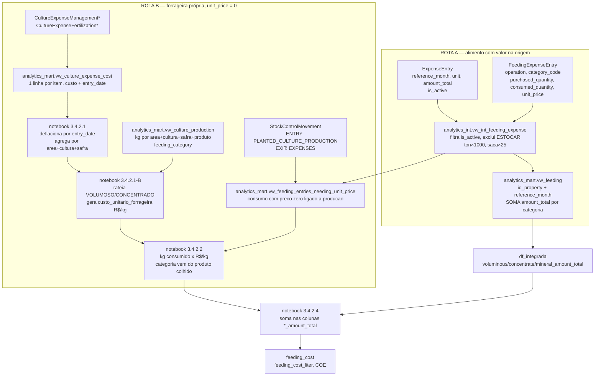

# Fluxo do custo de alimentação — do alimento produzido até `feeding_cost`

Auditoria de 02/08/2026. Todas as afirmações vêm de consultas somente-leitura rodadas no banco de produção; o SQL de cada uma está na seção [Queries de auditoria](#queries-de-auditoria).

Período de referência dos números: `reference_month >= 2024-01-01`, todas as propriedades, valores **nominais**.

---

## 1. Fluxograma



Grão de cada etapa:

| Etapa | Grão |
|---|---|
| `vw_int_feeding_expense` | 1 linha por `id_expense_entry` (confirmado: sem fan-out) |
| `vw_feeding` | 1 linha por `id_property` + `reference_month` |
| `vw_culture_expense_cost` | 1 linha por item de insumo, com `entry_date` própria |
| `vw_feeding_entries_needing_unit_price` | 1 linha por lançamento × lote de estoque |
| `df_integrada` | 1 linha por `id_property` + `reference_month` |

---

## 2. Resultado da auditoria

Tamanho do universo: `vw_feeding` entrega **R$ 1.944.902.984** em 1.021 propriedades desde 01/2024 — volumoso R$ 519.316.094, concentrado R$ 1.352.583.051, mineral R$ 73.003.839.

### 2.1 Defeitos confirmados

| # | Defeito | Onde | Tamanho medido |
|---|---|---|---|
| **D1** | **Dupla contagem do estoque comprado.** `ESTOCAR_CONSUMIR` lança em `vw_feeding` o `amount_total` da **compra inteira**, inclusive a parte que sobrou e foi para estoque. Quando essa sobra é consumida depois, o lançamento `CONSUMIR` traz outro `amount_total` e o mesmo dinheiro é contado de novo. | `vw_int_feeding_expense` exclui só `ESTOCAR` puro | **R$ 76.952.694** em 3.585 lançamentos, 324 fazendas (**4,0%** do custo de alimentação) |
| **D2** | **Alimento consumido sem custo nenhum.** Consumo com `amount_total = 0` cujo lote não é reconhecido pela rota B: sai como custo zero, sem aviso. Em 806 casos o lote não tem movimento `ENTRY` registrado; em 228, o lote veio de despesa (`ESTOCAR`/`ESTOCAR_CONSUMIR`) e a rota B só olha lote de colheita. | `vw_int_feeding_entries_needing_unit_price` exige `ENTRY` com `source_module = 'PLANTED_CULTURE_PRODUCTION'` | **62,4 milhões de kg** em 955 lançamentos, 137 fazendas — 60,8 M kg são volumoso |
| **D3** | **Base monetária misturada na mesma coluna.** `COLUNAS_DEFLACIONAR` não inclui `voluminous/concentrate/mineral_amount_total` (`COLUNAS_DEFLACIONAR_FORRAGEIRA` está comentada). O alimento comprado entra **nominal**; a forrageira própria entra **deflacionada** por IGP-DI. A soma da célula 3.4.2.4 junta as duas bases. | notebook, linhas ~1573-1588 e 3.4.2.4 | afeta 100% das linhas com forrageira própria — 3.501 lançamentos, 342,5 M kg |
| **D4** | **Categoria fora do padrão é silenciosamente zerada.** `vw_feeding` compara `category_code` com `'VOLUMOSO'`/`'CONCENTRADO'`/`'MINERAIS'` em caixa alta. Registros gravados em minúscula caem no `ELSE 0` — não aparecem em coluna nenhuma. | `vw_feeding` | 2 lançamentos, R$ 30.000 (pequeno hoje, mas cresce sem aviso) |
| **D5** | **Arquivo `.sql` do repo diverge do que está no banco.** [vw_feeding_entries_needing_unit_price.sql](../queries/analytics_mart/vw_feeding_entries_needing_unit_price.sql) seleciona `raw_consumed_quantity` e `unit`, que a view intermediária não projeta. Executar o arquivo hoje derruba a view do mart. | mart × int | bloqueia recriação |
| **D6** | **Comentário desatualizado no notebook.** §3.4.2.2 afirma que `consumption_reference_month` vem de `created_at`. O DDL no banco usa `ExpenseEntry.reference_month` — a mesma competência de `vw_feeding`. O mês está certo; o comentário está errado e induz a "corrigir" o que funciona. | notebook §3.4.2.2 item 3 | risco de regressão |
| **D7** | **Dupla contagem do estoque comprado, agora na despesa de cultura.** É o D1 do outro lado do fluxo: o Ramo 2 de `vw_management_cost` e `vw_fertilization_cost` projeta `line_total`, ou seja, a **compra inteira**, inclusive a parte estocada. Quando a sobra é baixada depois, o Ramo 1 traz o mesmo dinheiro de novo. | `vw_management_cost` e `vw_fertilization_cost`, bloco do `UNION ALL` | **R$ 44,2 milhões** — manejo R$ 30,9 mi (19,0% do ramo) e fertilizante R$ 13,3 mi (2,2%); 5,7% do custo de cultura |

### 2.2 Riscos verificados e descartados

| Hipótese | Veredito |
|---|---|
| Fan-out `ExpenseEntry` × `FeedingExpenseEntry` inflando `amount_total` | **Não ocorre.** Zero `id_expense_entry` com mais de uma linha |
| Unidades não convertidas caindo em `ELSE 1` | **Não ocorre.** Só existem `kg` (78.875), `ton` (781) e a saca do catálogo (1) — as três estão tratadas |
| Rota B dobrando custo de lançamento que já tem valor | **Não ocorre.** Os 3.501 lançamentos da rota B têm `amount_total = 0` sem exceção |
| Categoria divergente entre rota A e rota B | **Não ocorre.** 3.366 VOLUMOSO×VOLUMOSO e 135 CONCENTRADO×CONCENTRADO, nenhum cruzado |
| `id_production` duplicado em `vw_forage_production` inflando o rateio | **Não ocorre.** Zero duplicidade |
| Lançamento da rota B sem plantio ou sem produção da safra | **Não ocorre.** 0 sem plantio, 0 sem produção. Restam 111 de 3.501 (3,2%) sem custo lançado na safra — dado ausente na origem, não defeito de view |
| Rateio multi-lote em partes iguais distorcendo o total | **Marginal.** 20 lançamentos de 3.501 |

---

## 3. Como o custo do alimento produzido chega hoje

1. O insumo da lavoura é lançado em `CultureExpenseManagement*` / `CultureExpenseFertilization*` e vira linha em `vw_culture_expense_cost`, com `entry_date` própria.
2. O notebook deflaciona linha a linha pela data de compra e agrega por `id_area + id_culture + harvest_season`.
3. `vw_culture_production` diz quantos kg saíram daquela safra em cada `feeding_category`. O custo é rateado na proporção dos kg — o que faz VOLUMOSO e CONCENTRADO da mesma chave receberem o **mesmo R$/kg**.
4. A colheita entra em estoque: `StockControlMovement` com `ENTRY` e `source_module = 'PLANTED_CULTURE_PRODUCTION'`.
5. O consumo do rebanho gera `ExpenseEntry` + `FeedingExpenseEntry` com `unit_price = 0` e uma `EXIT` de `source_module = 'EXPENSES'` no mesmo `id_stock_control_item`.
6. `vw_feeding_entries_needing_unit_price` casa `EXIT` com `ENTRY` pelo item de estoque, chega em `id_production` → `id_planted_culture` → área/cultura/safra.
7. O notebook multiplica `consumed_quantity_kg` pelo R$/kg da safra e soma na coluna da categoria.

O elo frágil é o passo 6: **a única ponte entre o alimento produzido e o custo é o par ENTRY/EXIT em `StockControlMovement`**. Sem esse par, o alimento consumido fica com custo zero (D2).

Existe uma segunda fonte de preço no banco: `StockControlItem` tem `origin` (`COLHEITA` / `COMPRA`), `unit_value` e `unit_factor_kg`. Desde 02/08/2026 ela é usada como recurso quando o passo 6 não encontra produção — ver "Detalhe da regra D2" na seção 6.

---

## 4. Correções recomendadas

> Esta seção é o diagnóstico do dia 02/08/2026, mantida como registro. **Todas as seis foram aplicadas** — o que ficou implantado está na seção 6.

Ordem por impacto:

1. **D1** — decidir a regra e implementá-la em `vw_int_feeding_expense`: ou lançar `unit_price × consumed_quantity` para `ESTOCAR_CONSUMIR` (custo pelo consumo, sobra fica no estoque até ser consumida), ou manter o `amount_total` e excluir o consumo que sacar de lote gerado por `ESTOCAR_CONSUMIR`. A primeira é mais coerente com o indicador "custo do alimento consumido no mês".
2. **D3** — decidir a base do indicador e uniformizar: ou incluir as três colunas `*_amount_total` em `COLUNAS_DEFLACIONAR`, ou parar de deflacionar o custo da forrageira antes da soma.
3. **D2** — ampliar a rota B para lote sem `ENTRY` e para lote de origem `COMPRA`, provavelmente via `StockControlItem.unit_value` × `unit_factor_kg`, depois de validar a base da unidade.
4. **D4** — comparar `upper(trim(category_code))` em `vw_feeding`.
5. **D5** — alinhar o arquivo do repo ao DDL do banco (ou projetar as colunas na `int`, se forem desejadas).
6. **D6** — corrigir o comentário do notebook.

---

## Queries de auditoria

Reutilizáveis. Todas somente-leitura.

```sql
-- D1: dupla contagem do estoque comprado
SELECT count(*) AS linhas,
       round(sum(e.amount_total)::numeric,2) AS valor_cobrado_de_novo,
       count(DISTINCT f.id_property) AS fazendas
FROM "FeedingExpenseEntry" f
JOIN "ExpenseEntry" e ON f.id_expense_entry = e.id_expense_entry
JOIN "StockControlMovement" sai
  ON sai.source_reference_id = f.id_expense_entry
 AND sai.source_module = 'EXPENSES' AND sai.movement_type = 'EXIT'
JOIN "StockControlMovement" ent
  ON ent.id_stock_control_item = sai.id_stock_control_item
 AND ent.movement_type = 'ENTRY' AND ent.source_module = 'EXPENSES'
JOIN "FeedingExpenseEntry" orig
  ON orig.id_expense_entry = ent.source_reference_id
 AND orig.operation = 'ESTOCAR_CONSUMIR'::"ExpenseOperation"
WHERE e.is_active = true
  AND f.operation = 'CONSUMIR'::"ExpenseOperation"
  AND e.reference_month >= DATE '2024-01-01';

-- D2: alimento consumido sem custo e fora da rota B
SELECT fe.category_code, count(*) AS linhas,
       count(DISTINCT fe.id_property) AS fazendas,
       round(sum(fe.consumed_quantity_kg)::numeric,0) AS kg
FROM analytics_int.vw_int_feeding_expense fe
WHERE coalesce(fe.amount_total,0) = 0
  AND fe.reference_month >= DATE '2024-01-01'
  AND NOT EXISTS (
      SELECT 1 FROM analytics_int.vw_int_feeding_entries_needing_unit_price b
      WHERE b.id_expense_entry = fe.id_expense_entry)
GROUP BY 1 ORDER BY 4 DESC;

-- D4: categoria fora do padrao, descartada por vw_feeding
SELECT f.category_code, count(*) AS linhas, round(sum(e.amount_total)::numeric,2) AS valor
FROM "FeedingExpenseEntry" f
JOIN "ExpenseEntry" e ON f.id_expense_entry = e.id_expense_entry
WHERE e.is_active = true
  AND f.operation <> 'ESTOCAR'::"ExpenseOperation"
  AND f.category_code NOT IN ('VOLUMOSO','CONCENTRADO','MINERAIS')
GROUP BY 1 ORDER BY 3 DESC;

-- Coerencia de amount_total por operacao (compra x consumo)
SELECT f.operation::text AS operacao, count(*) AS linhas,
       count(*) FILTER (WHERE abs(coalesce(e.amount_total,0)
            - coalesce(f.unit_price,0)*coalesce(f.purchased_quantity,0)) < 0.01) AS igual_a_compra,
       count(*) FILTER (WHERE abs(coalesce(e.amount_total,0)
            - coalesce(f.unit_price,0)*coalesce(f.consumed_quantity,0)) < 0.01) AS igual_ao_consumo,
       round(sum(e.amount_total)::numeric,2) AS valor
FROM "FeedingExpenseEntry" f
JOIN "ExpenseEntry" e ON f.id_expense_entry = e.id_expense_entry
WHERE e.is_active = true GROUP BY 1 ORDER BY 1;

-- Cobertura da rota B ate o custo da safra
WITH b AS (
    SELECT b.id_expense_entry, pcs.id_area, pcs.id_culture, pcs.harvest_season
    FROM analytics_mart.vw_feeding_entries_needing_unit_price b
    LEFT JOIN analytics_mart.vw_planted_culture_season pcs
      ON pcs.id_planted_culture = b.id_planted_culture)
SELECT count(*) AS lancamentos,
       count(*) FILTER (WHERE b.id_area IS NULL) AS sem_plantio,
       count(*) FILTER (WHERE NOT EXISTS (
           SELECT 1 FROM analytics_mart.vw_culture_expense_cost c
           WHERE c.id_area=b.id_area AND c.id_culture=b.id_culture
             AND c.harvest_season=b.harvest_season)) AS sem_custo_da_safra
FROM b;
```

---

## 5. Caso real de referência — Fazenda Morro Feio

`id_property = da98a69c-40b2-4a76-a730-3b195afc7139`, período 01/2025 a 06/2026 (não há lançamento antes disso).

**Composição dos lançamentos**

| Operação | Categoria | Linhas | `amount_total` | Preço × consumo | Comprado | Consumido |
|---|---|---:|---:|---:|---:|---:|
| CONSUMIR | CONCENTRADO | 16 | 26.204,32 | 26.204,32 | 0 | 13.126 |
| CONSUMIR | VOLUMOSO | 16 | 127.229,78 | 127.233,65 | 0 | 2.212.250 |
| ESTOCAR | VOLUMOSO | 1 | 39.998,00 | — | 140.000 | 0 |
| ESTOCAR_CONSUMIR | CONCENTRADO | 62 | 730.462,93 | 710.676,07 | 394.080 | 380.854 |
| ESTOCAR_CONSUMIR | MINERAIS | 13 | 17.944,99 | 17.945,00 | 4.021 | 4.021 |

**D1 nesta fazenda: R$ 26.204,32 contados duas vezes.** Os 16 lançamentos `CONSUMIR` de concentrado sacam, sem exceção, de lote criado por `ESTOCAR_CONSUMIR` — cujo valor de compra já tinha entrado no custo. Espalhado por 12 meses entre 03/2025 e 06/2026, sendo R$ 9.382,81 só em 05/2026.

**D2 não ocorre aqui:** zero lançamentos sem valor e fora da rota B.

**Rota B funciona:** 11 meses com consumo de forrageira própria, de 126.850 kg (04/2025) a 164.555 kg (12/2025). Nos meses em que a rota B atua, `voluminous_amount_total` sai zero de `vw_feeding` e recebe o custo da safra só no notebook — comportamento esperado.

**Efeito da correção, mês a mês**

Custo total do período: **R$ 901.842,03 → R$ 882.059,05 (−2,2%)**.

| Mês | Total hoje | Total corrigido | Diferença |
|---|---:|---:|---:|
| 01/2025 | 21.812,40 | 21.812,40 | 0,00 |
| 02/2025 | 35.570,40 | 35.018,40 | −552,00 |
| 03/2025 | 31.627,28 | 30.043,28 | −1.584,00 |
| 04/2025 | 30.488,48 | 29.902,48 | −586,00 |
| 05/2025 | 38.001,84 | 36.329,84 | −1.672,00 |
| 06/2025 | 37.697,36 | 37.697,36 | 0,00 |
| 07/2025 | 41.785,90 | 40.961,90 | −824,00 |
| 08/2025 | 51.187,81 | 49.033,81 | −2.154,00 |
| 09/2025 | 52.417,06 | 52.417,06 | 0,00 |
| 10/2025 | 41.794,21 | 38.186,46 | −3.607,75 |
| 11/2025 | 49.138,81 | 46.933,82 | −2.204,99 |
| 12/2025 | 47.612,79 | 47.612,80 | +0,01 |
| 01/2026 | 69.509,41 | 69.510,56 | +1,14 |
| 02/2026 | 60.600,40 | 60.603,13 | +2,73 |
| 03/2026 | 50.271,21 | 50.271,21 | 0,00 |
| 04/2026 | 95.077,55 | 88.475,44 | −6.602,11 |
| 05/2026 | 83.282,12 | 83.282,12 | 0,00 |
| 06/2026 | 63.966,99 | 63.966,99 | 0,00 |

As diferenças positivas de centavos vêm de arredondamento do app entre `amount_total` e `unit_price × consumed_quantity`. Nenhuma passa de R$ 3.

---

## 6. Correções aplicadas em 02/08/2026

Os sete defeitos foram corrigidos. As seis views estão **implantadas no banco**; as mudanças de notebook só valem na próxima execução.

| # | Arquivo | Mudança | Estado |
|---|---|---|---|
| D1 | [vw_int_feeding_expense.sql](../queries/analytics_int/vw_int_feeding_expense.sql) | `amount_total` passa a ser `unit_price * consumed_quantity`. O valor da compra continua disponível em `purchase_amount_total`, coluna nova no fim | implantada |
| D2 | [vw_int_feeding_entries_needing_unit_price.sql](../queries/analytics_int/vw_int_feeding_entries_needing_unit_price.sql) e [vw_feeding_entries_needing_unit_price.sql](../queries/analytics_mart/vw_feeding_entries_needing_unit_price.sql) | join de produção vira `LEFT`, para o consumo sem colheita associada parar de desaparecer; novas colunas `stock_*` entregam o preço do lote; `category_code` sobe para o mart | implantadas |
| D2 | `app/Elabore Indicadores.ipynb` §3.4.2.2 | usa o preço do lote quando falta custo de safra, com faixa de sanidade por categoria | próxima execução |
| D3 | `app/Elabore Indicadores.ipynb` §3.4 | `COLUNAS_DEFLACIONAR_ALIMENTACAO` entra em `COLUNAS_DEFLACIONAR` | próxima execução |
| D4 | [vw_feeding.sql](../queries/analytics_mart/vw_feeding.sql) | categoria comparada com `upper(trim(...))`; arquivo passa a trazer o `CREATE OR REPLACE VIEW` | implantada |
| D5 | [vw_feeding_entries_needing_unit_price.sql](../queries/analytics_mart/vw_feeding_entries_needing_unit_price.sql) | removidas `raw_consumed_quantity` e `unit`, que a intermediária não projeta | implantada |
| D6 | `app/Elabore Indicadores.ipynb` §3.4.2.2 e §3.4.2.3 | comentários corrigidos | próxima execução |
| D7 | [vw_management_cost.sql](../queries/analytics_int/vw_management_cost.sql) e [vw_fertilization_cost.sql](../queries/analytics_int/vw_fertilization_cost.sql) | no Ramo 2, `quantity`, `quantity_kg` e `custo` passam a usar `COALESCE(consumed_quantity, quantity)`; `custo = consumed_quantity * unit_cost` | implantadas |
| D7 | `app/Elabore Indicadores.ipynb` §3.4.2.1-B | rateio do custo da safra volta a ser por etapa (colheita de planta inteira → volumoso, colheita de grão → concentrado, demais por área colhida), com os fatores normalizados por chave e etapa | próxima execução |

Backups: `*.sql.20260802.bak`, `app/backup/Elabore Indicadores_20260802_pre_fix_d1.ipynb`, `app/backup/Elabore Indicadores_20260802_171211_pre_fix_d2_d3.ipynb`, `app/backup/Elabore Indicadores_20260802_183607_pre_rateio_etapa.ipynb`. O DDL que estava no banco antes da implantação ficou em [_ddl_anterior_alimentacao_20260802.sql](../queries/_ddl_anterior_alimentacao_20260802.sql) e, para o D7, em [_ddl_anterior_despesa_cultura_20260802.sql](../queries/_ddl_anterior_despesa_cultura_20260802.sql) — são os rollbacks.

### Detalhe da regra D7

Achado a partir de `DESPESA_CULTURA_MORRO_FEIO.xlsx`, exportação do próprio app: a coluna `Valor compra` fechava com o que a view entregava (R$ 310.952,61 na área `6cbdeeca…`, cultura `723fd24b…`, safra 25/26) e a coluna `Valor consumo` com o que o cliente cobrava (R$ 303.092,21). A diferença de R$ 7.860,40 são seis linhas `ESTOCAR_CONSUMIR` com consumo menor que a compra — o 07-35-10 sozinho responde por R$ 4.888,40 (11.000 kg comprados, 10.000 consumidos).

Unidades seguem a mesma regra do D1: `unit_cost` é o preço por unidade do lançamento, então pareia com `consumed_quantity` bruta; `unit_cost_kg` pareia com `consumed_quantity_kg`. Conferência da origem: `consumed_quantity` nunca é nulo e nunca excede `quantity` (5 linhas em 17.738 estão zeradas), e `consumed_quantity_kg` é nulo exatamente onde `quantity_kg` é nulo.

Depois da implantação, `vw_culture_expense_cost` mantém as 17.809 linhas e cai de R$ 768,69 mi para R$ 724,48 mi — manejo R$ 131,70 mi e fertilizante R$ 592,78 mi. A chave do caso passa a dar R$ 303.092,21 exatos.

### Detalhe da regra D1

`unit_price` é o preço **por unidade do lançamento** (R$/ton nos lançamentos em tonelada), não por quilo. Por isso a conta usa `consumed_quantity` bruta, **sem** o fator de conversão para kg — aplicá-lo inflaria em 1.000× os 781 lançamentos em tonelada. A conferência sustenta a leitura: `amount_total` já é igual a `unit_price × consumed_quantity` em 65.325 de 67.731 lançamentos `ESTOCAR_CONSUMIR`.

Lançamentos com `unit_price = 0` continuam com custo zero — é exatamente a forrageira própria, precificada adiante pela rota B. Não há caso de `unit_price = 0` com `amount_total > 0`: as duas condições andam juntas em 100% dos registros.

### Impacto medido da correção (01/2024 em diante)

| Medida | Valor |
|---|---|
| Custo de alimentação hoje | R$ 1.944.982.147 |
| Custo com a nova regra | R$ 1.840.849.820 |
| Variação | **−5,36%** |
| Lançamentos que mudam | 2.484 de 77.682 |
| Valor recuperado por D4 | R$ 30.000 |

Distribuição por propriedade: 490 sem mudança nenhuma, 186 até 1%, 119 entre 1% e 5%, 152 entre 5% e 20%, e 74 acima de 20% (concentrando R$ 77,4 milhões da diferença).

As maiores quedas são compras grandes estocadas: `FAZENDA BARREIRO` comprou 4.500.000 kg de volumoso em 01/2026 e consumiu 220.000 kg — o mês registrava R$ 990.000 e passa a registrar R$ 48.400, com o resto virando custo conforme o estoque for consumido. `FAZENDA RIBEIRAO DA MATA` tem o mesmo padrão (5.500.000 kg comprados, 420.000 kg consumidos).

### Detalhe da regra D2

O preço de recurso é `StockControlItem.unit_value / unit_factor_kg`.

A dúvida que ficou aberta na auditoria era a base do `unit_value` — se por quilo ou por embalagem. Está resolvida: `unit_value` é o **mesmo `unit_price` do lançamento que originou o lote, na unidade do lançamento**. Nos 406 lotes em tonelada, `unit_value` mediano é 311,50 com `unit_factor_kg` 1.000, e o `unit_price` mediano do `FeedingExpenseEntry` de origem é os mesmos 311,50. Dividir pelo fator entrega R$/kg. A leitura anterior de "R$ 31/kg nos lotes de COMPRA" era erro de conta na auditoria, não característica do dado.

Prioridade: o custo da safra continua mandando. O preço do lote só age onde não existe `id_production`.

Cobertura dos 4.428 consumos com preço zero desde 01/2024:

| Situação do lote | Lançamentos | kg | Rota |
|---|---|---|---|
| `COLHEITA` com `ENTRY` de produção | 3.498 | 346.700.262 | custo da safra |
| `COLHEITA` sem `ENTRY` | 601 | 47.485.012 | preço do lote |
| `COMPRA` com `ENTRY` de `EXPENSES` | 232 | 12.648.442 | preço do lote |
| `COMPRA` sem `ENTRY` | 161 | 1.294.268 | preço do lote |
| lote inexistente | 78 | 5.522.786 | segue sem preço |

O fallback resolve **973 lançamentos e 62,2 milhões de kg** que entravam no indicador valendo zero, e acrescenta cerca de R$ 23,3 milhões nominais (volumoso R$ 18,8 M, concentrado R$ 4,2 M, mineral R$ 0,36 M). Restam 78 lançamentos e 5,5 M kg sem preço possível — não há lote no banco para consultar.

A faixa de sanidade fica no notebook, não na view, porque é premissa e não cálculo: volumoso até R$ 5,00/kg, concentrado até R$ 20,00/kg, mineral até R$ 50,00/kg. Justificativa medida: 683 dos 699 lançamentos de volumoso do fallback ficam abaixo de R$ 2,00/kg, e os 7 acima de R$ 5,00/kg somam R$ 2,7 milhões — preço de volumoso nessa ordem é erro de digitação. Os suspeitos são reportados no `print` da célula, nunca descartados em silêncio.

### Detalhe da regra D3

As três colunas `*_amount_total` entram em `COLUNAS_DEFLACIONAR` por meio de `COLUNAS_DEFLACIONAR_ALIMENTACAO`. Duas condições fazem isso ser correto agora e não antes:

1. Depois de D1, a coluna traz o custo do que foi **consumido no mês de referência**, não o valor de uma compra feita em outro mês. O deflator do próprio mês de referência passa a ser o deflator certo.
2. A deflação da §3.4 roda **antes** da §3.4.2, onde o custo da forrageira própria — já deflacionado — é somado nessas colunas. Não há dupla deflação.

O preço de fallback de D2 é nominal na data de compra do lote, então é deflacionado pelo IGP-DI de `stock_purchase_date`, e não pelo mês do consumo. Sem data de compra, cai no mês do consumo.

### Implantação

Feita em 02/08/2026, em transação única, nesta ordem:

```
vw_int_feeding_expense
vw_int_feeding_entries_needing_unit_price
vw_feeding
vw_feeding_entries_needing_unit_price
```

Conferências pós-implantação:

| Checagem | Resultado |
|---|---|
| Total de `vw_feeding` desde 01/2024 | R$ 1.840.861.623 (era R$ 1.944.982.147) |
| Fazenda Morro Feio, 01/2024 em diante | R$ 882.059,06 — bate com a simulação a menos de um centavo |
| Lançamento custando mais que a própria compra | 41 lançamentos, R$ 124,87 no total — ruído de arredondamento de `double precision`, média de R$ 3 |
| `FAZENDA BARREIRO` em 01/2026 | R$ 48.400 para 220.800 kg consumidos, contra R$ 990.000 para 4.500.000 kg comprados |
| Valor que deixou de ser lançado na compra e vira custo quando o estoque for consumido | R$ 104.162.327 |
| Colunas do mart | as três categorias seguem cobrindo 100% dos lançamentos |

Falta reexecutar o notebook e comparar `feeding_cost` com a exportação anterior em `data/outputs/monthly/`. Só nessa execução D2 e D3 passam a valer.

Para desfazer: `psql -f data/views/queries/_ddl_anterior_alimentacao_20260802.sql`.
